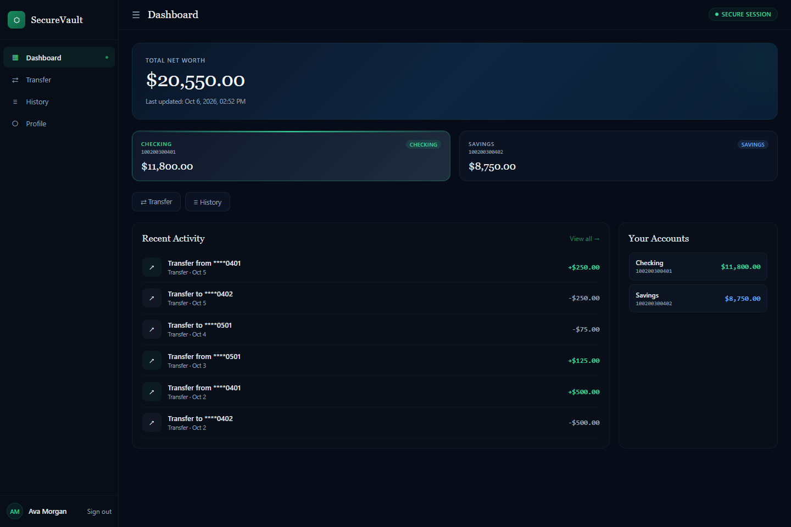
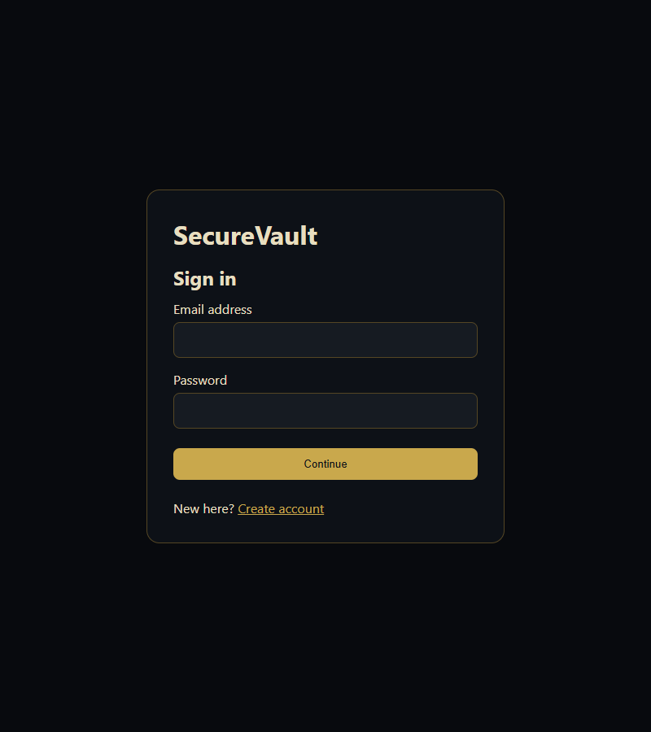
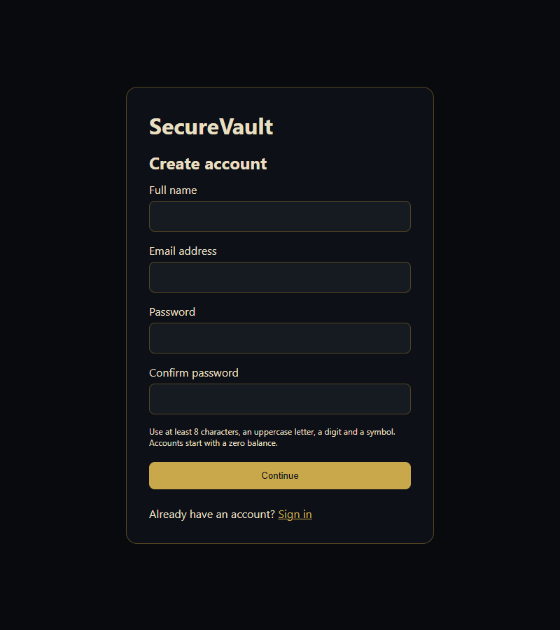
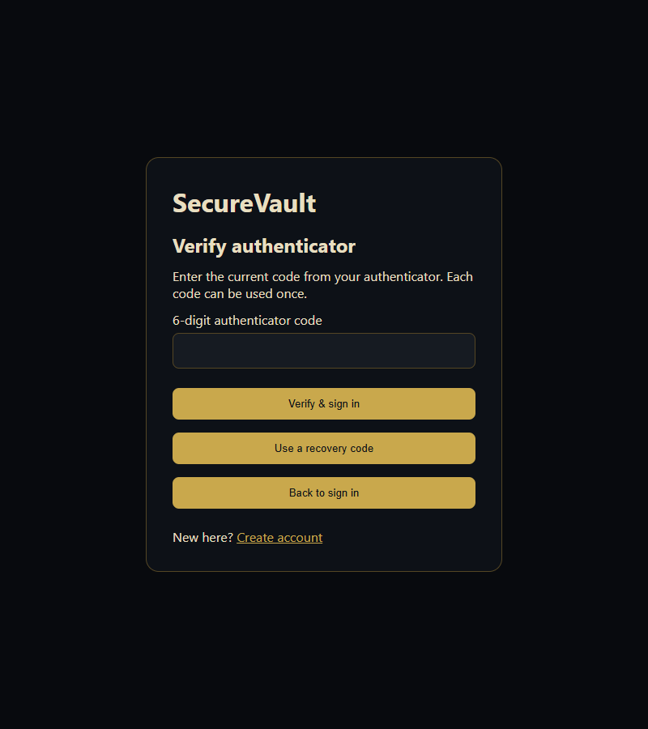
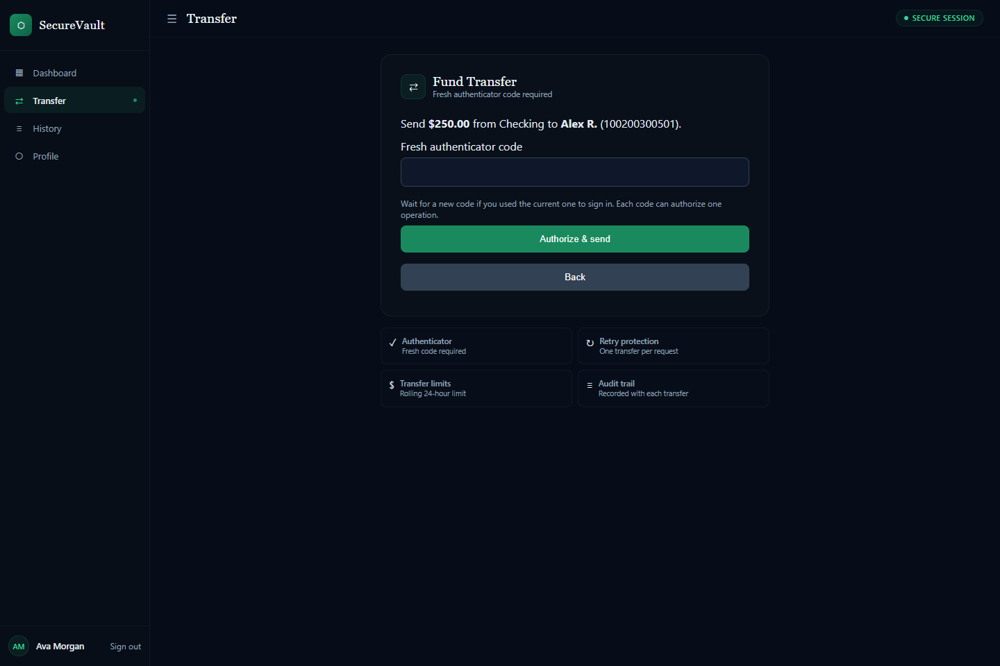
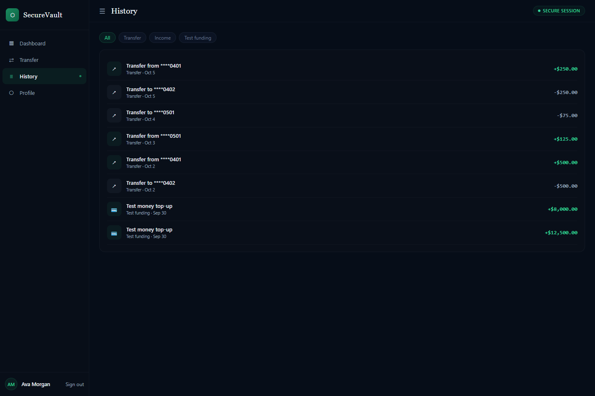
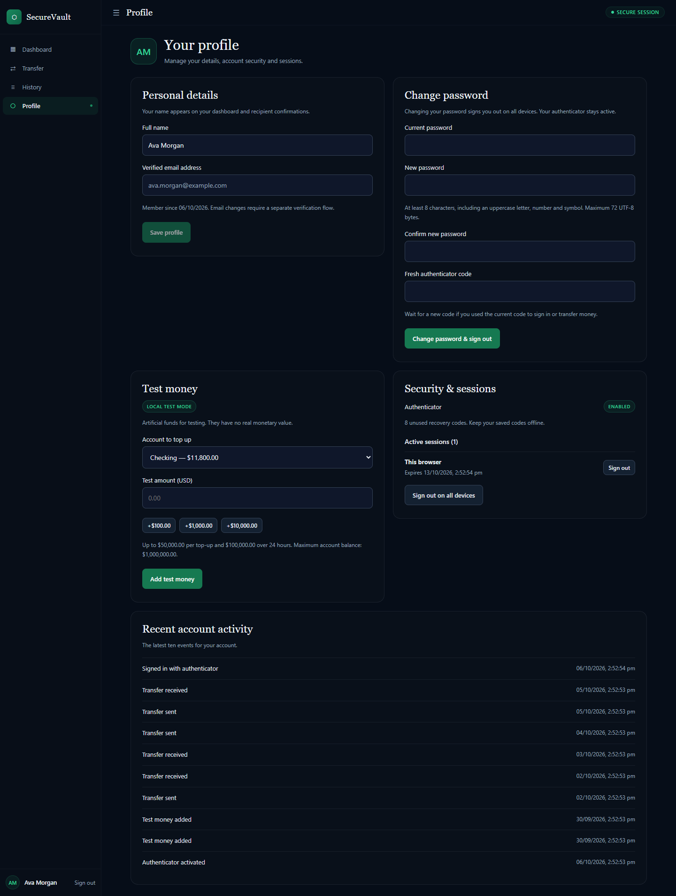
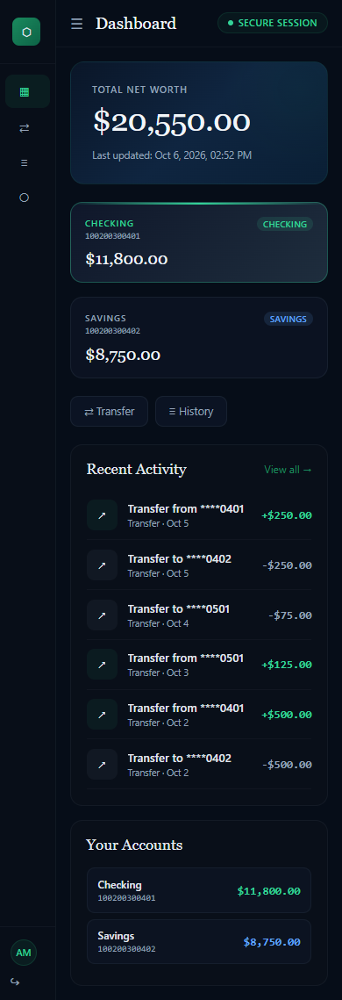

# SecureVault

SecureVault is a local account dashboard with email verification, mandatory authenticator verification, revocable sessions and atomic internal transfers. Requires **Node.js 24.21 or later**; `.nvmrc`, `.node-version`, Docker and CI pin **24.21.0**. Production refuses to start on an older runtime.

## Demo screenshots

Captured from the running app using fictional demo accounts and artificial test balances. The screenshots show desktop screens at 1440px, authentication screens at 800px, and the mobile dashboard at 390px.

### Account dashboard

Checking and savings balances, recent activity, and quick access to transfers and history.



### Registration and sign-in

| Sign in | Create account |
| --- | --- |
|  |  |

<details>
<summary>View authenticator verification</summary>

The password step is followed by a required authenticator code. One-time recovery codes are available for a lost authenticator.



</details>

### Transfers and transaction history

| Transfer review | Transaction history |
| --- | --- |
|  |  |

### Profile and mobile layout

| Profile and security | Mobile dashboard |
| --- | --- |
|  |  |

To regenerate the gallery after a UI change, install both projects' dependencies, then run:

```powershell
npm run demo:screenshots --prefix frontend
```

The capture script uses a temporary in-memory database and generates fresh demo credentials. It runs with installed Edge/Chrome, `BROWSER_PATH`, or Playwright's Chromium. Images are saved in [`docs/screenshots`](docs/screenshots). Your local account data is unaffected.

## Run locally

In two terminals from the project folder:

```powershell
npm ci --prefix backend
npm run dev --prefix backend
```

```powershell
npm ci --prefix frontend
npm run dev --prefix frontend
```

Open http://localhost:3000. Register with an email, then retrieve your development verification link locally:

```powershell
npm run mailbox --prefix backend -- your@email.example
```

Open the printed link and enter the password chosen when requesting it, then scan the QR code, enter the authenticator code, and save your eight recovery codes offline. Unsolicited links cannot create an account without that initiating password. Resuming unfinished enrollment requires a fresh email link and rotates the setup secret. The development mailbox is a command-line tool; it has no HTTP endpoint. Production sends verification links through SMTP.

Open **Profile** in the sidebar (or `/profile`) to edit your name, change your password, view security details and recent account activity, revoke individual sessions or sign out on all devices. Password changes require the current password and a fresh authenticator code; all sessions and outstanding password challenges are then revoked. Your verified email is read-only.

New accounts have **zero balances**. In local development, open **Profile → Test money**, choose your account and enter an amount or select a preset, then click **Add test money**. These artificial funds have no real monetary value. Funding is limited to $50,000 per request, $100,000 per user over 24 hours and a $1,000,000 resulting balance per account. HTTP and store funding are disabled in production, and the production profile hides the funding form. Credits, balancing ledger entries, history, audit and user-scoped retry results commit together. An uncertain result retains the original request; use **Retry test top-up** or **Check previous top-up** to avoid duplicate credits. Only an opaque retry key persists across closed tabs; account/amount details stay in session storage.

The operator command remains available for local test fixtures:

```powershell
npm run fund --prefix backend -- <account-id> 100.00 "Local test funding"
```

This creates balancing ledger entries. The command refuses to run in production. Use the recipient's full 12-digit account number, confirm the displayed name, and enter a **fresh** authenticator code. A code used for sign-in cannot also authorize a transfer. Unknown recipients are rejected; there is no external-payment settlement adapter.

If a transfer result is unconfirmed, retry the saved transfer or use **Check previous transfer**. Details survive navigation/reload in that tab. Only an opaque retry key is retained across closed tabs/browser restarts; after signing in, use it to retrieve the server's recorded result. An absent result keeps the same key for re-entering the original details, and another unresolved transfer blocks a new payment in that browser. Passwords, authenticator codes, access tokens and financial details are never written to persistent local storage. Current HTTPS browsers coordinate refresh/payment submissions across tabs and broadcast sign-out to the other tabs. Browser history filters query the complete server history and retry failed pages without skipping records.

## Data and secrets

Development creates separate random signing/encryption keys and a durable SQLite database in **%USERPROFILE%\.securevault** on Windows, or **~/.securevault** elsewhere. The old project-local environment secrets and demo credentials have been removed. Project-local `.env` files are no longer loaded.

Use `SECUREVAULT_ENV_FILE` to load a private file outside the project. See `backend/.env.example`. Production requires four distinct 64-character random hex keys, exact HTTPS origins, SMTP configuration, and an absolute durable database path. Never reuse signing keys as encryption keys. Preserve the encryption key with protected database backups; changing it without a coordinated data migration makes encrypted records unreadable.

SQLite uses WAL, full synchronous commits, a busy timeout and `BEGIN IMMEDIATE`. Balances are integer cents with database constraints. Debit, credit, both ledger entries, both transaction records, rolling-limit accounting, audit and idempotency results commit together. Multiple processes can share the **same local database file**. Separate machines or independent database files require a database server architecture; do not put this SQLite database on a network filesystem.

## Validation

```powershell
npm test --prefix backend
npm run lint --prefix frontend
npm test --prefix frontend
npm run build --prefix frontend
npm run test:browser --prefix frontend
npm audit --prefix backend
npm audit --prefix frontend
```

The browser regressions use installed Edge/Chrome (or `BROWSER_PATH` or Playwright's Chromium) and disposable in-memory databases. They check built pages, CSP, login, exact-cent transfers, committed operations with lost responses followed by navigation/reload/retry, recovery after closing a tab, failed history-page retries, concurrent tabs, sign-out propagation, mobile width, password-bound email proof, QR enrollment and recovery-code display. Profile coverage includes protected links, name changes, artificial funding, history, session revocation, password changes and sign-out on all devices. Jest covers a separate production-mode server with durable storage, HSTS and Secure cookies, and verifies that artificial funding is unavailable in production. It uses Node's VM module support for the authenticator library. Tests do not disable rate limiting in the running app; the app factory allows that option only in the test environment.

## Deployment and operations

The Dockerfile builds the frontend and serves it through Express. `compose.yaml` adds a Caddy HTTPS proxy and a persistent database volume. Set `VAULT_DOMAIN`, `SECUREVAULT_ENV_FILE` and the matching `PUBLIC_ORIGIN`/`CORS_ORIGINS` before deployment. The backend is not published directly by Compose. Its proxy trust setting assumes exactly the supplied proxy.

`/health` reports liveness; `/ready` checks database access and an encrypted key-verification record. Existing databases reject a mismatched encryption key at startup. `/api/metrics` requires an authenticated admin role and returns request/error counts, uptime and resident memory without personal data. Every user's audit endpoint is scoped to that user. There is no public admin-creation endpoint; role provisioning is an operator responsibility.

Create a consistent backup at a new absolute destination:

```powershell
npm run backup --prefix backend -- C:\PrivateBackups\securevault-2026-10-06.sqlite
```

Protect that file and the matching encryption key. Schedule backups, retain several copies outside the host, and regularly rehearse restoration on an isolated instance. Restore only after stopping all writers. Never copy only a live SQLite main file while ignoring its WAL. Financial ledger/audit history and idempotency records are retained durably; archive them under an explicit operational retention policy. Expired challenges, rate-limit buckets, registration proofs, mail jobs and refresh records are cleaned automatically.

Backup opens an existing source read-only, checks its integrity, reserves the destination exclusively and refuses missing sources, existing destinations and project-local backups. It cannot silently create a fresh empty source database. Run `npm run reconcile --prefix backend` regularly; it reports unexplained balances, unbalanced ledger references and unmatched transaction records, and exits unsuccessfully when any are found. Transaction history, ledger and audit records are append-only. New database/backup files use owner-only POSIX permissions; provision Windows ACLs for the service account and private backup directory.

Schema 3 migrates schema 1/2 databases atomically, retains balances/credentials and invalidates old enrollment challenges. Back up before upgrading and preserve the existing encryption key. Email-proof claims now require both `ticket` and `password`; API clients must follow the updated flow.

Mail delivery uses a durable encrypted outbox with retry leasing and TLS. Check `mail_delivery_failed` events and undelivered jobs; configure a real sender/provider and verify delivery before exposing registration. Links expire 30 minutes after the request; dispatch drops expired or claimed proofs. Jobs stop retrying after five failures, and stale workers cannot acknowledge a newer lease. Shutdown drains pending mail before closing the database, with a 45-second application deadline and 50-second Compose grace period. Delivery can be repeated after a worker/provider failure; the email proof remains single-use. Users can request a fresh link by registering again or signing in to an unfinished account.

For lost authenticators, customers can use a one-time recovery code **plus their password**. Recovery revokes all existing sessions. If all recovery codes are lost, an operator must verify identity through the support process before running:

```powershell
npm run reset-2fa --prefix backend -- <user-id> <support-case-reference> --identity-verified
```

Provide the printed replacement recovery codes securely to the verified customer. The operation is audited, revokes all sessions, preserves the password requirement and keeps transfers blocked until a new authenticator is enrolled. Authenticator protection cannot be disabled through the API.

In production, new recipients have a 30-minute cooling-off period. Sender and recipient accounts must be active, and the recipient user must be active. Transfers have per-IP/per-account velocity limits, a $50,000 single limit, and a $100,000 rolling 24-hour outgoing limit. These controls do not supply identity verification, sanctions screening, payment-rail settlement, regulatory approval or a staffed fraud program. This application is not a licensed banking service.

The CI workflow runs backend/frontend tests, lint, build, browser regressions, production dependency audits and a Docker image build when this project is placed in a GitHub repository. Container deployment, live SMTP delivery, external monitoring and scheduled backup operation need environment-specific validation; they were not deployed to an external service during the repair.

See [AUDIT_FIXES.md](AUDIT_FIXES.md) for the original findings and [REAUDIT_FIXES.md](REAUDIT_FIXES.md) for the follow-up repairs and current validation evidence.
